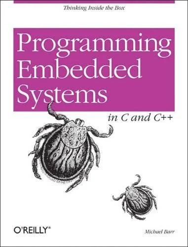

# Embedded Book Examples
Welcome to my Embedded Book Examples GitHub Repo! In this repo you can expect to find projects I programmed on my **NUCLEO-L476RG** while reading Programming Embedded Systems by Michael Barr.
-----------------------------------------------------
## Book 

_Programming Embedded Systems in C and C++, Michael Barr_

## Projects 
### Hello World aka blinking an LED 
| Hello World | Blinks the onboard LED using bare metal register access with no HAL library. Directly toggles the NUCLEO-L476RG's GPIO output register with a software delay loop. |
